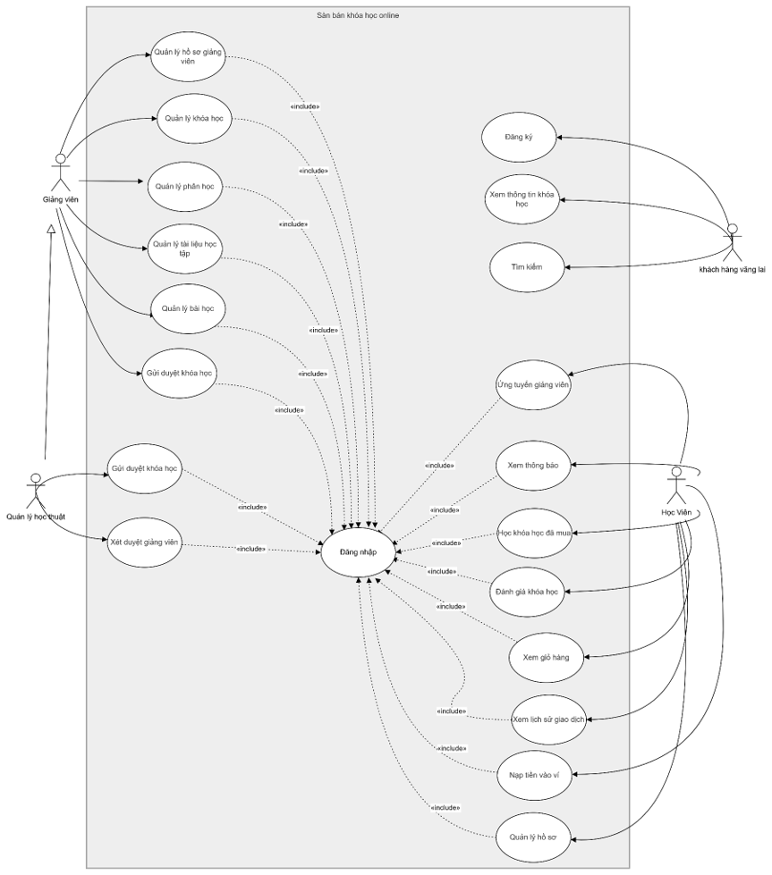
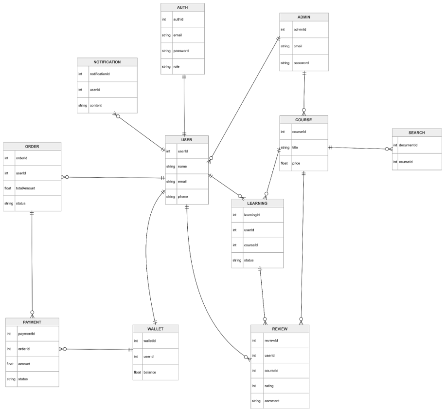

# EduPlatform — Nền Tảng Học Trực Tuyến Microservices

Dự án môn công nghệ mới xây dựng hệ thống học trực tuyến quy mô lớn theo kiến trúc microservices, lấy cảm hứng từ Udemy. Hệ thống hỗ trợ đầy đủ vòng đời từ tạo khoá học, thanh toán đa nhà cung cấp, theo dõi tiến độ học tập đến cấp chứng chỉ tự động.

---

## Mục Lục

- [Phân Tích Nghiệp Vụ (Business Analysis)](#phân-tích-nghiệp-vụ)
  - [Bối Cảnh Nghiệp Vụ](#1-bối-cảnh-nghiệp-vụ)
  - [Các Bên Liên Quan](#2-các-bên-liên-quan-stakeholders)
  - [Use Case Diagram](#3-use-case-diagram)
  - [Yêu Cầu Chức Năng](#4-yêu-cầu-chức-năng-functional-requirements)
  - [Yêu Cầu Phi Chức Năng](#5-yêu-cầu-phi-chức-năng-non-functional-requirements)
  - [Quy Tắc Nghiệp Vụ](#6-quy-tắc-nghiệp-vụ-business-rules)
  - [Domain Model](#7-domain-model)
  - [Đặc Tả Luồng Nghiệp Vụ Chính](#8-đặc-tả-luồng-nghiệp-vụ-chính)
- [Kiến Trúc Kỹ Thuật (Technical Architecture)](#kiến-trúc-kỹ-thuật)
  - [Kiến Trúc Tổng Quan](#kiến-trúc-tổng-quan)
  - [Stack Công Nghệ](#stack-công-nghệ)
  - [Database Per Service](#database-per-service-architecture)
  - [Các Microservice](#các-microservice)
  - [Giao Tiếp Giữa Các Service](#giao-tiếp-giữa-các-service)
  - [Luồng Mua Khoá Học](#luồng-mua-khoá-học-end-to-end)
  - [Cơ Sở Hạ Tầng](#cơ-sở-hạ-tầng--triển-khai)
- [Phân Quyền Người Dùng](#phân-quyền-người-dùng)
- [Tính Năng Nổi Bật](#tính-năng-nổi-bật)
- [Cấu Trúc Thư Mục](#cấu-trúc-thư-mục)
- [Chạy Dự Án](#chạy-dự-án)

---
# Link báo cáo dự án
[Xem ở đây](https://docs.google.com/document/d/1QM7R1VIYggNwNYhfeJ8nmMD91Fvc0aIBgudX9yNnw1g/edit?tab=t.0)

# Phân Tích Nghiệp Vụ

## 1. Bối Cảnh Nghiệp Vụ

### Vấn đề (Problem Statement)

Thị trường học trực tuyến Việt Nam tăng trưởng trung bình 20%/năm, tuy nhiên các nền tảng hiện có chưa đáp ứng đồng thời:
- Cơ chế kiểm duyệt nội dung đảm bảo chất lượng giảng dạy
- Thanh toán nội địa (MoMo, ví điện tử) bên cạnh thanh toán quốc tế
- Cơ chế chia sẻ doanh thu minh bạch cho giảng viên
- Chứng chỉ số có thể xác minh sau khi hoàn tất khoá học

### Giải Pháp

Xây dựng **EduPlatform** — nền tảng B2C kết nối giảng viên và học viên, đảm bảo:

| Mục tiêu | Giải pháp |
|---|---|
| Chất lượng nội dung | Workflow duyệt khoá học 3 bước (Draft → Pending → Published) |
| Doanh thu giảng viên | Tự động chia 80% mỗi đơn hàng qua Wallet Service |
| Thanh toán linh hoạt | Stripe (quốc tế) + MoMo (Việt Nam) |
| Tin cậy học tập | Chứng chỉ số tự động cấp khi hoàn tất, có endpoint xác minh |
| Hiệu năng cao | Kiến trúc microservices, scale độc lập từng service |

---

## 2. Các Bên Liên Quan (Stakeholders)

### Ma Trận Stakeholder

| Stakeholder | Loại | Mức Ảnh Hưởng | Nhu Cầu Chính | Mối Quan Tâm |
|---|---|---|---|---|
| **Học Viên** (Student) | Người dùng cuối | Cao | Tìm, mua, học khoá học chất lượng | Giá cả, chất lượng nội dung, tiến độ học |
| **Giảng Viên** (Instructor) | Người dùng cuối | Cao | Tạo khoá học, theo dõi doanh thu | Tỉ lệ hoa hồng, công cụ tạo nội dung, số học viên |
| **Quản Lý Học Thuật** (Admin) | Nội bộ | Cao | Kiểm duyệt nội dung, quản lý chất lượng | Công cụ review hiệu quả, báo cáo tổng quan |
| **Khách Hàng Vãng Lai** (Guest) | Người dùng tiềm năng | Trung bình | Khám phá, tìm kiếm khoá học | Tốc độ tải trang, thông tin khoá học rõ ràng |
| **Nền Tảng** (Business) | Chủ hệ thống | Cao | Tăng trưởng người dùng, doanh thu | Hoa hồng 20%, giữ chân người dùng, uy tín thương hiệu |

### Bản Đồ Kỳ Vọng Stakeholder

```
                    Ảnh hưởng CAO
                          │
          Quản lý ────────┼──────── Giảng viên
          học thuật        │         Học viên
                          │
    ──────────────────────┼────────────────────── Quan tâm
    THẤP                  │                        CAO
                          │
                    Khách hàng
                    vãng lai
                          │
                    Ảnh hưởng THẤP
```

---

## 3. Use Case Diagram

### Tổng Quan Actor và Use Case


### Chi Tiết Use Case Theo Actor

#### Actor 1: Khách Hàng Vãng Lai (Guest)
| ID | Use Case | Mô Tả | Điều Kiện Tiên Quyết |
|---|---|---|---|
| UC-G01 | Đăng ký tài khoản | Tạo tài khoản mới với email/mật khẩu hoặc Google | Chưa có tài khoản |
| UC-G02 | Xem thông tin khoá học | Xem chi tiết khoá học, nội dung chương trình, giá | Khoá học đã xuất bản |
| UC-G03 | Tìm kiếm khoá học | Tìm theo từ khoá, lọc theo giá/chủ đề/rating | Không yêu cầu |

#### Actor 2: Học Viên (Student)
| ID | Use Case | Mô Tả | Điều Kiện Tiên Quyết |
|---|---|---|---|
| UC-S01 | Đăng nhập | Xác thực bằng JWT/Google OAuth | Có tài khoản |
| UC-S02 | Quản lý hồ sơ | Cập nhật thông tin cá nhân, ảnh đại diện | Đã đăng nhập |
| UC-S03 | Xem giỏ hàng | Thêm/xoá khoá học, xem tổng giá | Đã đăng nhập |
| UC-S04 | Thanh toán | Thanh toán qua Stripe hoặc MoMo | Có khoá học trong giỏ |
| UC-S05 | Học khoá học đã mua | Xem bài học, đánh dấu hoàn thành theo tiến độ | Đã mua khoá học |
| UC-S06 | Đánh giá khoá học | Viết đánh giá, xếp hạng 1–5 sao | Đã học ít nhất 1 bài |
| UC-S07 | Xem lịch sử giao dịch | Xem các đơn hàng đã thanh toán | Đã đăng nhập |
| UC-S08 | Nạp tiền vào ví | Nạp tiền vào ví điện tử trên nền tảng | Đã đăng nhập |
| UC-S09 | Xem thông báo | Nhận thông báo đơn hàng, chứng chỉ | Đã đăng nhập |
| UC-S10 | Ứng tuyển giảng viên | Gửi yêu cầu nâng cấp vai trò thành giảng viên | Đã đăng nhập |

#### Actor 3: Giảng Viên (Instructor)
| ID | Use Case | Mô Tả | Điều Kiện Tiên Quyết |
|---|---|---|---|
| UC-I01 | Đăng nhập | Xác thực, truy cập dashboard giảng viên | Được duyệt làm giảng viên |
| UC-I02 | Quản lý hồ sơ giảng viên | Cập nhật tiểu sử, chuyên môn, thông tin ngân hàng | Đã đăng nhập |
| UC-I03 | Quản lý khoá học | Tạo, sửa, xoá khoá học (CRUD) | Đã đăng nhập |
| UC-I04 | Quản lý phần học | Tạo/sắp xếp các chương (Section) trong khoá học | Khoá học tồn tại |
| UC-I05 | Quản lý bài học | Thêm bài học video/text vào từng chương | Section tồn tại |
| UC-I06 | Quản lý tài liệu học tập | Upload, quản lý tài liệu đính kèm | Bài học tồn tại |
| UC-I07 | Gửi duyệt khoá học | Chuyển trạng thái khoá học từ Draft → Pending | Khoá học đầy đủ nội dung |

#### Actor 4: Quản Lý Học Thuật (Admin)
| ID | Use Case | Mô Tả | Điều Kiện Tiên Quyết |
|---|---|---|---|
| UC-A01 | Đăng nhập | Xác thực tài khoản quản trị | Có tài khoản admin |
| UC-A02 | Xét duyệt khoá học | Duyệt/từ chối khoá học Pending, gửi phản hồi | Có khoá học Pending |
| UC-A03 | Xét duyệt giảng viên | Duyệt/từ chối yêu cầu trở thành giảng viên | Có yêu cầu chờ duyệt |
| UC-A04 | Quản lý người dùng | Khoá/mở tài khoản, xem lịch sử vi phạm | Đã đăng nhập |
| UC-A05 | Xem analytics nền tảng | Dashboard doanh thu, người dùng, khoá học | Đã đăng nhập |

---

## 4. Yêu Cầu Chức Năng (Functional Requirements)

### Module Xác Thực & Người Dùng

| ID | Yêu Cầu | Độ Ưu Tiên | Actor |
|---|---|---|---|
| FR-AU-01 | Hệ thống cho phép đăng ký bằng email/mật khẩu | Must Have | Guest |
| FR-AU-02 | Hệ thống hỗ trợ đăng nhập qua Google OAuth 2.0 | Must Have | Guest |
| FR-AU-03 | JWT Access Token hết hạn sau 15 phút; Refresh Token 7 ngày | Must Have | All |
| FR-AU-04 | Gửi email xác minh khi đăng ký | Must Have | Guest |
| FR-AU-05 | Học viên có thể cập nhật ảnh đại diện và thông tin cá nhân | Should Have | Student |
| FR-AU-06 | Học viên gửi yêu cầu trở thành giảng viên (kèm hồ sơ năng lực) | Must Have | Student |

### Module Khoá Học

| ID | Yêu Cầu | Độ Ưu Tiên | Actor |
|---|---|---|---|
| FR-CS-01 | Giảng viên tạo khoá học với tiêu đề, mô tả, giá, ảnh bìa | Must Have | Instructor |
| FR-CS-02 | Giảng viên thêm Section (chương) và Lesson (bài học) | Must Have | Instructor |
| FR-CS-03 | Giảng viên upload tài liệu đính kèm cho bài học | Should Have | Instructor |
| FR-CS-04 | Khoá học có 3 trạng thái: Draft / Pending / Published | Must Have | System |
| FR-CS-05 | Giảng viên gửi khoá học để admin duyệt | Must Have | Instructor |
| FR-CS-06 | Admin duyệt hoặc từ chối khoá học với lý do cụ thể | Must Have | Admin |
| FR-CS-07 | Chỉ khoá học Published mới hiển thị với học viên | Must Have | System |
| FR-CS-08 | Hệ thống hỗ trợ coupon/mã giảm giá cho khoá học | Should Have | Instructor |

### Module Tìm Kiếm

| ID | Yêu Cầu | Độ Ưu Tiên | Actor |
|---|---|---|---|
| FR-SE-01 | Tìm kiếm full-text theo tiêu đề, mô tả khoá học | Must Have | Guest, Student |
| FR-SE-02 | Lọc theo khoảng giá (min/max) | Should Have | Guest, Student |
| FR-SE-03 | Lọc theo chủ đề/danh mục | Should Have | Guest, Student |
| FR-SE-04 | Lọc theo rating trung bình | Should Have | Guest, Student |
| FR-SE-05 | Sắp xếp theo giá / rating / mới nhất | Should Have | Guest, Student |
| FR-SE-06 | Index tự động cập nhật khi khoá học được xuất bản hoặc có đánh giá mới | Must Have | System |

### Module Đơn Hàng & Thanh Toán

| ID | Yêu Cầu | Độ Ưu Tiên | Actor |
|---|---|---|---|
| FR-OR-01 | Học viên thêm/xoá khoá học vào giỏ hàng | Must Have | Student |
| FR-OR-02 | Học viên checkout và chọn phương thức thanh toán | Must Have | Student |
| FR-OR-03 | Tích hợp Stripe để thanh toán thẻ quốc tế | Must Have | Student |
| FR-OR-04 | Tích hợp MoMo để thanh toán ví điện tử Việt Nam | Must Have | Student |
| FR-OR-05 | Xử lý webhook callback từ Stripe/MoMo để xác nhận thanh toán | Must Have | System |
| FR-OR-06 | Sau thanh toán thành công, tự động mở quyền truy cập khoá học | Must Have | System |
| FR-OR-07 | Học viên xem lịch sử đơn hàng | Should Have | Student |

### Module Học Tập & Chứng Chỉ

| ID | Yêu Cầu | Độ Ưu Tiên | Actor |
|---|---|---|---|
| FR-LR-01 | Hệ thống tạo enrollment khi đơn hàng được thanh toán | Must Have | System |
| FR-LR-02 | Học viên đánh dấu hoàn thành từng bài học | Must Have | Student |
| FR-LR-03 | Hệ thống tính % tiến độ hoàn thành khoá học | Should Have | System |
| FR-LR-04 | Tự động cấp chứng chỉ số khi học viên hoàn thành 100% khoá học | Must Have | System |
| FR-LR-05 | Cung cấp endpoint công khai để xác minh tính hợp lệ của chứng chỉ | Should Have | System |

### Module Ví & Doanh Thu

| ID | Yêu Cầu | Độ Ưu Tiên | Actor |
|---|---|---|---|
| FR-WL-01 | Mỗi người dùng có ví điện tử riêng trên nền tảng | Must Have | System |
| FR-WL-02 | Sau mỗi đơn hàng: 80% doanh thu chuyển vào ví giảng viên | Must Have | System |
| FR-WL-03 | Giảng viên xem lịch sử giao dịch ví | Should Have | Instructor |
| FR-WL-04 | Học viên nạp tiền vào ví để thanh toán khoá học | Should Have | Student |

### Module Đánh Giá & Thông Báo

| ID | Yêu Cầu | Độ Ưu Tiên | Actor |
|---|---|---|---|
| FR-RV-01 | Học viên viết đánh giá và xếp hạng 1–5 sao sau khi học | Must Have | Student |
| FR-RV-02 | Rating trung bình khoá học cập nhật realtime | Should Have | System |
| FR-NF-01 | Gửi thông báo khi đơn hàng được xác nhận | Must Have | System |
| FR-NF-02 | Gửi thông báo khi chứng chỉ được cấp | Should Have | System |
| FR-NF-03 | Gửi thông báo khi khoá học được duyệt/từ chối | Should Have | System |

---

## 5. Yêu Cầu Phi Chức Năng (Non-Functional Requirements)

### Hiệu Năng (Performance)

| ID | Yêu Cầu | Mục Tiêu |
|---|---|---|
| NFR-PF-01 | Thời gian phản hồi API tìm kiếm | < 200ms ở percentile 95 |
| NFR-PF-02 | Thời gian phản hồi API thanh toán | < 500ms (không tính thời gian redirect) |
| NFR-PF-03 | Throughput tối thiểu | 500 requests/giây trên API Gateway |
| NFR-PF-04 | Thời gian tải trang frontend | < 3 giây trên kết nối 4G |

### Bảo Mật (Security)

| ID | Yêu Cầu | Chi Tiết |
|---|---|---|
| NFR-SC-01 | Xác thực JWT trên mọi API bảo vệ | RS256 algorithm, kiểm tra tại API Gateway |
| NFR-SC-02 | Mã hoá mật khẩu | bcrypt với salt rounds ≥ 12 |
| NFR-SC-03 | Rate limiting | Max 100 req/phút/IP; 10 req/phút trên auth endpoints |
| NFR-SC-04 | Không lưu dữ liệu thẻ thanh toán | Delegate 100% cho Stripe/MoMo PCI-DSS compliant |
| NFR-SC-05 | HTTPS bắt buộc | TLS 1.2+ trên mọi kết nối |

### Độ Tin Cậy & Khả Dụng (Reliability & Availability)

| ID | Yêu Cầu | Mục Tiêu |
|---|---|---|
| NFR-RA-01 | Uptime hệ thống | ≥ 99.5% (cho phép ~22 giờ downtime/năm) |
| NFR-RA-02 | Xử lý lỗi service | Circuit breaker pattern, fallback graceful |
| NFR-RA-03 | Eventual consistency | Dữ liệu nhất quán trong vòng 5 giây sau event |
| NFR-RA-04 | Không mất dữ liệu thanh toán | At-least-once delivery qua RabbitMQ, idempotency key |

### Khả Năng Mở Rộng (Scalability)

| ID | Yêu Cầu | Chi Tiết |
|---|---|---|
| NFR-SL-01 | Scale ngang độc lập | Mỗi service deploy và scale riêng biệt |
| NFR-SL-02 | Stateless service | Không lưu session trên server (dùng JWT + Redis) |
| NFR-SL-03 | Database isolation | Mỗi service có database riêng (xem Database Per Service) |

---

## 6. Quy Tắc Nghiệp Vụ (Business Rules)

### Phân Chia Doanh Thu

```
┌─────────────────────────────────────────────────┐
│            MÔ HÌNH DOANH THU                    │
│                                                  │
│   Học viên thanh toán: 100% giá khoá học         │
│              ↓                                   │
│   ┌──────────────────────────────────┐           │
│   │   Ví Giảng Viên      80%        │           │
│   │   Hoa hồng Nền tảng  20%        │           │
│   └──────────────────────────────────┘           │
│                                                  │
│   Phân phối tức thì sau khi payment.succeeded   │
└─────────────────────────────────────────────────┘
```

### Vòng Đời Khoá Học

```
  [Giảng viên tạo]
        ↓
    DRAFT ──────────────────────────────▶ Giảng viên có thể edit tự do
        ↓ Giảng viên "Gửi Duyệt"
    PENDING ─────────────────────────▶ Giảng viên không edit được
        ↓ Admin duyệt          ↓ Admin từ chối
    PUBLISHED               DRAFT (kèm lý do từ chối)
        ↓
  Hiển thị công khai, có thể mua
```

### Quy Tắc Học Tập & Chứng Chỉ

| ID | Quy Tắc |
|---|---|
| BR-LR-01 | Học viên chỉ truy cập khoá học sau khi đơn hàng ở trạng thái PAID |
| BR-LR-02 | Chứng chỉ được cấp khi và chỉ khi tất cả bài học đã được đánh dấu hoàn thành |
| BR-LR-03 | Mỗi học viên chỉ có 1 enrollment cho 1 khoá học (không mua lại) |
| BR-LR-04 | Học viên chỉ đánh giá được khoá học đã mua |

### Quy Tắc Quản Lý Giảng Viên

| ID | Quy Tắc |
|---|---|
| BR-IN-01 | Học viên phải gửi yêu cầu và được Admin duyệt mới trở thành Giảng Viên |
| BR-IN-02 | Admin có thể thu hồi quyền giảng viên; khoá học của giảng viên bị khoá sẽ bị ẩn |
| BR-IN-03 | Giảng viên nhận doanh thu từ khoá học Published, không nhận từ khoá học bị ẩn |

---

## 7. Domain Model

### Sơ Đồ Thực Thể Nghiệp Vụ


### Mô Tả Các Thực Thể Chính

| Thực Thể | Mô Tả | Thuộc Tính Quan Trọng |
|---|---|---|
| **AUTH** | Thông tin xác thực tài khoản | role (student/instructor/admin) |
| **USER** | Hồ sơ người dùng | name, email, phone |
| **COURSE** | Khoá học trên nền tảng | title, price, status (draft/pending/published) |
| **LEARNING** | Mối quan hệ học viên – khoá học | status (enrolled/in-progress/completed) |
| **ORDER** | Đơn hàng mua khoá học | totalAmount, status (pending/paid/cancelled) |
| **PAYMENT** | Giao dịch thanh toán | amount, provider (stripe/momo), status |
| **WALLET** | Ví điện tử người dùng | balance |
| **REVIEW** | Đánh giá khoá học | rating (1–5), comment |
| **NOTIFICATION** | Thông báo hệ thống | content, isRead |
| **SEARCH** | Index tìm kiếm khoá học | Tổng hợp dữ liệu từ Course + Review |

---

## 8. Đặc Tả Luồng Nghiệp Vụ Chính

### Luồng 1: Mua Khoá Học (Happy Path)

```
Học Viên          API Gateway      Order Svc      Payment Svc     RabbitMQ     Learning Svc
    │                   │               │               │               │              │
    │── Thêm giỏ hàng ─▶│               │               │               │              │
    │                   │── POST /cart─▶│               │               │              │
    │                   │               │── Lưu cart ──▶│               │              │
    │                   │               │               │               │              │
    │── Checkout ───────▶│               │               │               │              │
    │                   │── POST /order▶│               │               │              │
    │                   │               │── gRPC ───────▶│               │              │
    │                   │               │               │── Tạo intent ─│              │
    │                   │               │◀── URL ────────│               │              │
    │◀── Redirect URL ──│               │               │               │              │
    │                   │               │               │               │              │
    │── [Thanh toán trên Stripe/MoMo] ──────────────────▶│               │              │
    │                   │               │               │── Webhook ────│              │
    │                   │               │               │    payment    │              │
    │                   │               │               │   .succeeded  │              │
    │                   │               │◀── Event ─────│               │              │
    │                   │               │── Update PAID─▶               │              │
    │                   │               │── Publish ────────────────────▶ order.paid   │
    │                   │               │               │               │── Enroll ───▶│
    │                   │               │               │               │   Notify ──▶ Notif Svc
    │◀── Thông báo ─────│               │               │               │              │
```

### Luồng 2: Xuất Bản Khoá Học

```
Giảng Viên      Course Svc      Admin Svc       RabbitMQ       Search Svc
    │               │               │               │               │
    │── Tạo KH ────▶│               │               │               │
    │               │── status=DRAFT│               │               │
    │               │               │               │               │
    │── Gửi duyệt──▶│               │               │               │
    │               │── PENDING ────▶               │               │
    │               │               │               │               │
    │               │               │── Admin review│               │
    │               │               │── Duyệt ─────▶│               │
    │               │◀── PUBLISHED ─│   course      │               │
    │               │               │  .published   │               │
    │               │               │               │── Index ─────▶│
    │               │               │               │   full-text   │
    │◀── Thông báo ─│               │               │               │
```

### Luồng 3: Hoàn Tất Khoá Học & Cấp Chứng Chỉ

```
Học Viên      Learning Svc      RabbitMQ      Certificate Svc    Notification Svc
    │               │               │               │                   │
    │── Học bài ───▶│               │               │                   │
    │               │── Đánh dấu ──▶│               │                   │
    │               │   hoàn thành  │               │                   │
    │               │               │               │                   │
    │── Bài cuối ──▶│               │               │                   │
    │               │── Tính 100% ──│               │                   │
    │               │── Publish ────▶ course        │                   │
    │               │               │  .completed   │                   │
    │               │               │── Cấp chứng ─▶│                   │
    │               │               │   chỉ số      │── Lưu cert ──────│
    │               │               │               │── Publish ───────▶ cert.issued
    │               │               │               │                   │── Thông báo
    │◀── Nhận cert ─│               │               │                   │
```

### Luồng 4: Ứng Tuyển Giảng Viên

```
Học Viên      User Svc         Admin Svc       Auth Svc
    │              │               │               │
    │── Gửi hồ ──▶│               │               │
    │   sơ GV      │── Pending ───▶│               │
    │              │               │               │
    │              │── Admin xem ─▶│               │
    │              │   & duyệt     │               │
    │              │               │               │
    │              │◀── Approved ──│               │
    │              │── Update role▶│               │
    │              │   INSTRUCTOR  │               │
    │              │               │── Update ────▶│
    │              │               │   JWT role    │
    │◀── Thông báo─│               │               │
```

---

# Kiến Trúc Kỹ Thuật

## Kiến Trúc Tổng Quan

```
┌─────────────────────────────────────────────────────────────────────┐
│                          CLIENT (Browser)                           │
│               React 18 + TypeScript + Vite + Tailwind CSS           │
└──────────────────────────────┬──────────────────────────────────────┘
                               │ HTTPS / REST
┌──────────────────────────────▼──────────────────────────────────────┐
│                         API Gateway :3000                           │
│          Express + http-proxy-middleware + Rate Limiting            │
└──┬───┬───┬───┬───┬───┬───┬───┬───┬───┬───┬───┬──────────────────────┘
   │   │   │   │   │   │   │   │   │   │   │   │   REST / gRPC
   ▼   ▼   ▼   ▼   ▼   ▼   ▼   ▼   ▼   ▼   ▼   ▼
  Auth User Course Search Order Payment Wallet Learning Cert Review Notif Admin
 :3001 :3002 :3003 :3004 :3005 :3006  :3007  :3008  :3009 :3010 :3011 :3012

                    Analytic Service :8000 (Python FastAPI)

┌─────────────────── Infrastructure Layer ────────────────────────────┐
│  PostgreSQL 15  │  MongoDB 7  │  Redis 7  │  RabbitMQ 3.12  │ Kafka │
└─────────────────────────────────────────────────────────────────────┘
```

---

## Stack Công Nghệ

### Backend (Node.js Microservices)

| Thành phần | Công nghệ | Mục đích |
|---|---|---|
| Runtime | **Node.js 20 LTS** | Nền tảng thực thi |
| Framework | **Express.js 4.18** | HTTP server cho 12 service |
| RPC đồng bộ | **gRPC + Protocol Buffers** | Giao tiếp nội bộ giữa các service |
| ORM (SQL) | **Prisma 5** | Auth, Order, Payment, Wallet, Search |
| ODM (NoSQL) | **Mongoose 8** | User, Course, Learning, Certificate, Review |
| SQL DB | **PostgreSQL 15** | Dữ liệu có cấu trúc (đơn hàng, thanh toán) |
| NoSQL DB | **MongoDB 7** | Dữ liệu linh hoạt (khoá học, tiến độ) |
| Cache | **Redis 7** | refresh_token lưu trữ |
| Message Broker | **RabbitMQ 3.12** | Sự kiện bất đồng bộ giữa các service |
| Event Streaming | **Apache Kafka 3.7** | Hành vi người dùng, analytics |
| Xác thực | **JWT + Google OAuth 2.0** | Phiên đăng nhập, SSO |
| Thanh toán | **Stripe + MoMo** | Quốc tế và ví điện tử Việt Nam |
| Logging | **Winston** | Structured logging |
| Validation | **Joi** | Input validation |
| File Upload | **Multer** | Ảnh, tài liệu khoá học |
| Container | **Docker + Docker Compose** | Triển khai toàn bộ stack |

### Backend (Python Service)

| Thành phần | Công nghệ | Mục đích |
|---|---|---|
| Framework | **FastAPI 0.115** | Analytic Service (:8000) |
| Async ORM | **SQLAlchemy 2.0 (async)** | Truy vấn analytics bất đồng bộ |
| DB Driver | **asyncpg** | Kết nối PostgreSQL hiệu năng cao |
| WebSocket | **FastAPI WebSocket** | Realtime metrics dashboard |
| Kafka Client | **aiokafka** | Consume user behavior events |

### Frontend

| Thành phần | Công nghệ | Phiên bản |
|---|---|---|
| Framework | **React** | 18.3.1 |
| Ngôn ngữ | **TypeScript** | Latest |
| Build tool | **Vite** | 6.3.5 |
| Routing | **React Router** | 7.13.0 |
| Styling | **Tailwind CSS 4** + Emotion | 4.1.12 |
| UI Components | **Radix UI** + MUI + Ant Design | — |
| Form | **React Hook Form** | 7.55.0 |
| HTTP Client | **Axios** | 1.13.6 |
| Charts | **Recharts** | 2.15.2 |
| Drag & Drop | **React DnD** | 16.0.1 |
| Animation | **Motion (Framer Motion)** | 12.23 |
| Icons | **Lucide React** | 0.487.0 |
| Toast | **Sonner** | 2.0.3 |
| Dark mode | **next-themes** | 0.4.6 |

---

## Database Per Service Architecture

Mỗi microservice sở hữu và quản lý database riêng — không service nào truy cập trực tiếp vào database của service khác. Dữ liệu được chia sẻ qua gRPC hoặc message event.

```
┌───────────────────────────────────────────────────────────────────────────────────────────┐
│                            DATABASE PER SERVICE ARCHITECTURE                              │
├───────────────────────────────────────────────────────────────────────────────────────────┤
│                                                                                           │
│  ┌──────────────────┐   ┌──────────────────┐   ┌──────────────────┐                      │
│  │  Auth Service    │   │  User Service    │   │  Course Service  │                      │
│  │     :3001        │   │     :3002        │   │     :3003        │                      │
│  │                  │   │                  │   │                  │                      │
│  │  ┌────────────┐  │   │  ┌────────────┐  │   │  ┌────────────┐  │                      │
│  │  │ PostgreSQL │  │   │  │  MongoDB   │  │   │  │  MongoDB   │  │                      │
│  │  │  auth_db   │  │   │  │  users_db  │  │   │  │ courses_db │  │                      │
│  │  │            │  │   │  │            │  │   │  │            │  │                      │
│  │  │ AUTH       │  │   │  │ User       │  │   │  │ Course     │  │                      │
│  │  │            │  │   │  │ Profile    │  │   │  │ Section    │  │                      │
│  │  └────────────┘  │   │  └────────────┘  │   │  │ Lesson     │  │                      │
│  └──────────────────┘   └──────────────────┘   │  │ Document   │  │                      │
│                                                 │  └────────────┘  │                      │
│  ┌──────────────────┐   ┌──────────────────┐   └──────────────────┘                      │
│  │  Search Service  │   │  Order Service   │                                             │
│  │     :3004        │   │     :3005        │   ┌──────────────────┐                      │
│  │                  │   │                  │   │  Payment Service │                      │
│  │  ┌────────────┐  │   │  ┌────────────┐  │   │     :3006        │                      │
│  │  │ PostgreSQL │  │   │  │ PostgreSQL │  │   │                  │                      │
│  │  │ search_db  │  │   │  │ orders_db  │  │   │  ┌────────────┐  │                      │
│  │  │            │  │   │  │            │  │   │  │ PostgreSQL │  │                      │
│  │  │ Document   │  │   │  │ Order      │  │   │  │payments_db │  │                      │
│  │  │ (Index)    │  │   │  │ CartItem   │  │   │  │            │  │                      │
│  │  └────────────┘  │   │  └────────────┘  │   │  │ Payment    │  │                      │
│  └──────────────────┘   └──────────────────┘   │  │ Transaction│  │                      │
│                                                 │  └────────────┘  │                      │
│  ┌──────────────────┐   ┌──────────────────┐   └──────────────────┘                      │
│  │  Wallet Service  │   │ Learning Service │                                             │
│  │     :3007        │   │     :3008        │   ┌──────────────────┐                      │
│  │                  │   │                  │   │ Cert Service     │                      │
│  │  ┌────────────┐  │   │  ┌────────────┐  │   │     :3009        │                      │
│  │  │ PostgreSQL │  │   │  │  MongoDB   │  │   │                  │                      │
│  │  │ wallets_db │  │   │  │learning_db │  │   │  ┌────────────┐  │                      │
│  │  │            │  │   │  │            │  │   │  │  MongoDB   │  │                      │
│  │  │ Wallet     │  │   │  │ Enrollment │  │   │  │  certs_db  │  │                      │
│  │  │ WalletTx   │  │   │  │ Progress   │  │   │  │            │  │                      │
│  │  └────────────┘  │   │  └────────────┘  │   │  │ Certificate│  │                      │
│  └──────────────────┘   └──────────────────┘   │  │ Template   │  │                      │
│                                                 │  └────────────┘  │                      │
│  ┌──────────────────┐   ┌──────────────────┐   └──────────────────┘                      │
│  │ Review Service   │   │ Notif Service    │                                             │
│  │     :3010        │   │     :3011        │   ┌──────────────────┐                      │
│  │                  │   │                  │   │  Admin Service   │                      │
│  │  ┌────────────┐  │   │  ┌────────────┐  │   │     :3012        │                      │
│  │  │  MongoDB   │  │   │  │  MongoDB   │  │   │                  │                      │
│  │  │ reviews_db │  │   │  │  notif_db  │  │   │  (No own DB)     │                      │
│  │  │            │  │   │  │            │  │   │  Gọi service     │                      │
│  │  │ Review     │  │   │  │ Notif      │  │   │  khác qua gRPC   │                      │
│  │  │ Rating     │  │   │  │            │  │   │                  │                      │
│  │  └────────────┘  │   │  └────────────┘  │   └──────────────────┘                      │
│  └──────────────────┘   └──────────────────┘                                             │
│                                                                                           │
├───────────────────────────────────────────────────────────────────────────────────────────┤
│                            SHARED INFRASTRUCTURE (Không Service Riêng)                   │
│                                                                                           │
│   ┌──────────────┐    ┌──────────────────┐    ┌─────────────────┐    ┌─────────────────┐ │
│   │   Redis 7    │    │  RabbitMQ 3.12   │    │   Kafka 3.7     │    │  Analytic Svc   │ │
│   │              │    │                  │    │                 │    │     :8000       │ │
│   │ • JWT Cache  │    │ • order.paid     │    │ • user.behavior │    │                 │ │
│   │ • Rate limit │    │ • course.pub     │    │ • course.view   │    │  ┌───────────┐  │ │
│   │ • Sessions   │    │ • cert.issued    │    │ • search.query  │    │  │ PostgreSQL│  │ │
│   │              │    │ • review.created │    │                 │    │  │analytics_db│  │ │
│   └──────────────┘    └──────────────────┘    └─────────────────┘    │  └───────────┘  │ │
│                                                                        └─────────────────┘ │
└───────────────────────────────────────────────────────────────────────────────────────────┘
```

### Lý Do Chọn PostgreSQL vs MongoDB Cho Từng Service

| Service | Database | Lý Do |
|---|---|---|
| Auth, Order, Payment, Wallet, Search | PostgreSQL | Dữ liệu quan hệ chặt, cần ACID transaction (giao dịch tài chính) |
| User, Course, Learning, Cert, Review, Notif | MongoDB | Schema linh hoạt, dữ liệu lồng nhau (bài học trong section trong khoá học) |

---

## Các Microservice

### 1. API Gateway (:3000 / :4000)
Điểm vào duy nhất của hệ thống. Xử lý rate limiting, CORS, bảo mật header (Helmet) và định tuyến đến 12 service phía sau.

### 2. Auth Service (:3001)
Đăng ký, đăng nhập, JWT (access 15 phút / refresh 7 ngày), Google OAuth 2.0, xác minh email. Expose gRPC server để các service khác xác thực token.

### 3. User Service (:3002)
Quản lý hồ sơ học viên và giảng viên. Xử lý đăng ký giảng viên, upload ảnh đại diện. Lắng nghe event từ RabbitMQ.

### 4. Course Service (:3003)
CRUD khoá học, section, bài học. Quản lý coupon/giảm giá. Workflow xuất bản khoá học (draft → pending → published). Phát event đến Kafka và RabbitMQ.

### 5. Search Service (:3004)
Tìm kiếm full-text khoá học với filter (giá, chủ đề, rating, sắp xếp). Đồng bộ index qua event `course.published`, `course.updated`, `review.created`.

### 6. Order Service (:3005)
Giỏ hàng, checkout, lịch sử đơn hàng. Gọi Payment Service qua gRPC để đồng bộ trạng thái. Phát event `order.paid` khi thanh toán thành công.

### 7. Payment Service (:3006)
Tích hợp **Stripe** (thẻ quốc tế), **MoMo** (ví điện tử VN) và provider MOCK (test). Webhook endpoints xử lý callback thanh toán. Expose gRPC server.

### 8. Wallet Service (:3007)
Ví học viên và ví giảng viên. Nạp tiền, lịch sử giao dịch. Nhận hoa hồng 80% từ mỗi đơn bán khoá học sau khi trừ 20% phí nền tảng.

### 9. Learning Service (:3008)
Quản lý enrollment, theo dõi tiến độ từng bài học, đánh dấu hoàn thành. Phát event `course.completed` khi học viên hoàn tất khoá học.

### 10. Certificate Service (:3009)
Tự động cấp chứng chỉ khi nhận event `course.completed`. Endpoint xác minh chứng chỉ.

### 11. Review Service (:3010)
CRUD đánh giá và xếp hạng khoá học. Phát event `review.created/updated` để Search Service cập nhật rating.

### 12. Notification Service (:3011)
Quản lý thông báo realtime. Lắng nghe các event `order.paid`, `course.enrolled`, `certificate.issued` và tạo thông báo cho người dùng.

### 13. Admin Service (:3012)
Phê duyệt khoá học, khóa/mở khóa giảng viên, xem analytics nền tảng. Không có database riêng, gọi các service khác qua gRPC.

### 14. Analytic Service (:8000) — Python FastAPI
Thu thập hành vi người dùng từ Kafka. Cung cấp dashboard metrics realtime qua WebSocket. Dùng async SQLAlchemy + asyncpg cho hiệu năng cao.

---

## Giao Tiếp Giữa Các Service

### gRPC (Đồng bộ — dữ liệu quan trọng)
```
API Gateway  ──► Auth Service        (xác thực token)
Order        ──► Payment Service     (kiểm tra giao dịch)
Order        ──► Course Service      (lấy thông tin khoá học)
Learning     ──► Course Service      (kiểm tra enrollment)
Admin        ──► User/Course Service (quản lý)
```

### RabbitMQ (Bất đồng bộ — sự kiện nghiệp vụ)
```
Course Service    → Search Service          (course.published / updated)
Payment Service   → Order Service           (payment.succeeded / failed)
Order Service     → Learning Service        (order.paid → tạo enrollment)
Order Service     → Wallet Service          (order.paid → cộng hoa hồng)
Order Service     → Notification Service    (order.paid → thông báo)
Learning Service  → Certificate Service     (course.completed → cấp chứng chỉ)
Certificate Svc   → Notification Service    (certificate.issued → thông báo)
Review Service    → Search Service          (review.created → cập nhật rating)
```

### Kafka (Event Streaming — analytics)
```
Course/Order Service → Analytic Service     (hành vi người dùng)
```

---

## Luồng Mua Khoá Học (End-to-End)

```
Học viên chọn khoá học
        ↓
Thêm vào giỏ hàng (Order Service)
        ↓
Checkout → chọn Stripe / MoMo / Mock
        ↓
Payment Service tạo payment intent / redirect URL
        ↓
Người dùng thanh toán (Stripe Checkout / MoMo QR)
        ↓
Webhook callback → Payment Service xác nhận
        ↓
RabbitMQ: payment.succeeded
        ↓
Order Service cập nhật trạng thái → RabbitMQ: order.paid
        ↓
┌──────────────────────────────────────┐
│  Learning Service: tạo enrollment    │
│  Wallet Service: cộng 80% giảng viên │
│  Notification: thông báo học viên    │
└──────────────────────────────────────┘
        ↓
Học viên học → đánh dấu bài → hoàn tất khoá học
        ↓
Certificate Service tự động cấp chứng chỉ
```

---

## Cơ Sở Hạ Tầng & Triển Khai

```
docker-compose.yml
├── postgres:15        — 5 database riêng biệt (init-postgres/init-databases.sh)
├── mongo:7            — MongoDB cho NoSQL data
├── redis:7            — Caching layer
├── rabbitmq:3.12      — Message broker (management UI :15672)
├── kafka:3.7          — Event streaming
├── zookeeper          — Kafka coordinator
├── stripe-cli         — Webhook forwarding (dev)
└── 14 service containers (mỗi service có Dockerfile riêng)
```

Mỗi service độc lập, có health check, khởi động theo thứ tự phụ thuộc (`depends_on`). Data persistence qua Docker volumes.

---

## Phân Quyền Người Dùng

| Role | Quyền hạn |
|---|---|
| **Student** | Tìm kiếm, đăng ký, học, đánh giá, nhận chứng chỉ, quản lý ví |
| **Instructor** | Tạo/sửa khoá học, quản lý section/bài học, xem doanh thu, rút tiền |
| **Admin** | Phê duyệt khoá học, quản lý giảng viên, xem analytics toàn nền tảng |

---

## Tính Năng Nổi Bật

- **Kiến trúc microservices hoàn chỉnh** — 14 service độc lập, giao tiếp qua REST, gRPC và message queue
- **Thanh toán đa nhà cung cấp** — Stripe (quốc tế) + MoMo (Việt Nam)
- **Realtime analytics** — Kafka + WebSocket dashboard
- **Certificate automation** — Cấp chứng chỉ tự động khi hoàn tất khoá học
- **Event-driven** — Loose coupling qua RabbitMQ đảm bảo tính nhất quán eventual
- **Dual database strategy** — PostgreSQL cho dữ liệu quan hệ, MongoDB cho dữ liệu linh hoạt
- **Full Docker stack** — Toàn bộ infrastructure chạy bằng một lệnh `docker-compose up`
- **Proto-based contracts** — gRPC với Protocol Buffers đảm bảo type safety giữa các service

---

## Cấu Trúc Thư Mục

```
.
├── backend/
│   ├── api-gateway/         — Express reverse proxy
│   ├── auth-service/        — JWT + OAuth
│   ├── user-service/        — Hồ sơ người dùng
│   ├── course-service/      — Quản lý khoá học
│   ├── search-service/      — Tìm kiếm full-text
│   ├── order-service/       — Đơn hàng & giỏ hàng
│   ├── payment-service/     — Stripe + MoMo
│   ├── wallet-service/      — Ví điện tử
│   ├── learning-service/    — Tiến độ học tập
│   ├── certificate-service/ — Cấp chứng chỉ
│   ├── review-service/      — Đánh giá khoá học
│   ├── notification-service/— Thông báo realtime
│   ├── admin-service/       — Quản trị nền tảng
│   ├── analytic-service/    — Python FastAPI analytics
│   ├── shared/              — Shared utilities (logger, middleware, RabbitMQ)
│   ├── proto/               — gRPC Protocol Buffer definitions
│   └── init-postgres/       — DB initialization scripts
├── frontend/
│   └── CongNgheMoi_FrontEnd-/  — React + TypeScript SPA
└── README.md
```

---

## Chạy Dự Án

```bash
# Clone và khởi động toàn bộ stack
git clone <repo>
cd "do_An_Cn_Moi_backup - Copy"

# Tạo file .env (xem backend/.env.example)
cp backend/.env.example backend/.env

# Khởi động toàn bộ infrastructure + services
docker-compose up --build

# Frontend (development)
cd frontend/CongNgheMoi_FrontEnd-
npm install
npm run dev
```

API Gateway: `http://localhost:3000`  
Frontend: `http://localhost:5173`  
RabbitMQ Management: `http://localhost:15672`  
Analytic Service: `http://localhost:8000`
